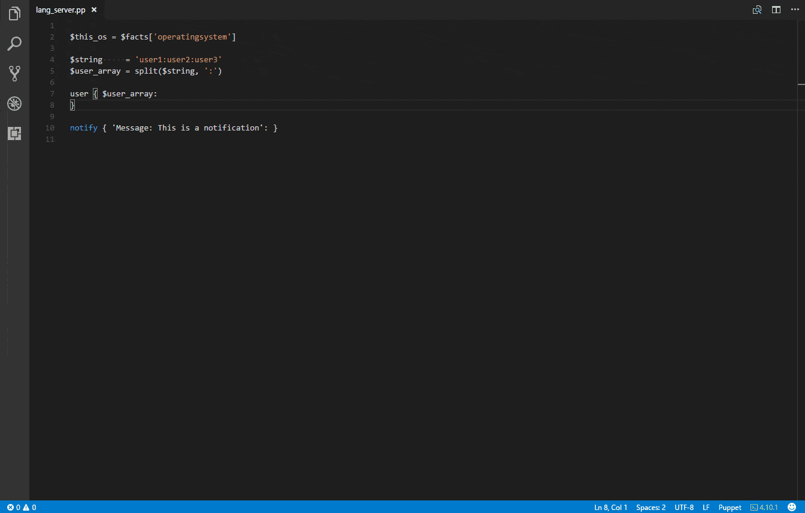

[](https://marketplace.visualstudio.com/items?itemName=jpogran.puppet-vscode) [](https://marketplace.visualstudio.com/items?itemName=jpogran.puppet-vscode)

[](https://ci.appveyor.com/project/jpogran/puppet-vscode) [](https://travis-ci.org/jpogran/puppet-vscode)

# Puppet Language Support for Visual Studio Code

This extension provides Puppet Language support for [Visual Studio Code](https://code.visualstudio.com/).

**It is currently in technical preview, so that we can gather bug reports and find out what new features to add.**

## Platform support

- Microsoft Windows
- MacOSX
- Linux

## Features

- [Syntax highlighting](#Syntax_Highlighting)
- [Code snippets](#Code_snippets)
- IntelliSense for resources, parameters and more
- Import from `puppet resource` directly into manifests
- Node graph preview




## Requirements

You will need to have Puppet Agent installed in order to fully use this extension. You can find installation links here:

* [Windows](https://docs.puppet.com/puppet/4.10/install_windows.html)
* [MacOSX](https://docs.puppet.com/puppet/4.10/install_osx.html)
* [Linux](https://docs.puppet.com/puppet/4.10/install_linux.html)

## Feature information

### Syntax Highlighting

Syntax highlighting uses [puppet-lint](https://github.com/rodjek/puppet-lint) and displays the results as you type, within VSCode.

- Puppet DSL
- Puppet Grammar

### Code Snippets

As part of IntelliSense and Snippets, you can quickly create blocks of code

### Linting

Our validation uses [puppet-lint](https://github.com/rodjek/puppet-lint) to validate the Pupept syntax in all open puppet files. Linting is automatically applied to the document as you edit, without having to save the file first.

### Puppet Resource

You can import existing resources directly using `puppet resource`

1. Open the command palette (`Ctrl+Shift+P`)

2. Type `puppet resource` and press enter

3. Enter the resource type you want to import, for example `user`

### Node Graph preview

You can preview the [node graph](https://puppet.com/blog/visualize-your-infrastructure-models) of a manifest while you edit your Puppet Code.

1. Open the command palette (`Ctrl+Shift+P`)

2. Type `puppet open node`.. and press enter

The node graph will appear next to the manifest

## Installing the Extension

You can install the official release of the Puppet extension by following the steps
in the [Visual Studio Code documentation](https://code.visualstudio.com/docs/editor/extension-gallery).
In the Extensions pane, search for "jpogran-puppet" extension and install it there.  You will
get notified automatically about any future extension updates!

## Reporting Problems

If you're having trouble with the PowerShell extension, please follow these instructions
to file an issue on our GitHub repository:

### 1. File an issue on our [Issues Page](https://github.com/PowerShell/vscode-powershell/issues)

Make sure to fill in the information that is requested in the issue template as it
will help us investigate the problem more quickly.

### 2. Capture verbose logs and send them to us

If you're having an issue with crashing or other erratic behavior, add the following
line to your User Settings in Visual Studio Code:

```json
    "puppet.languageserver.debugFilePath": "C:\\Some\\file\\path.txt"
```

Restart Visual Studio Code and try to reproduce the problem, then examine the log. If the issue persists please open an issue.

## Maintainers

- [James Pogran](https://github.com/jpogran) - [@ender2025](http://twitter.com/ender2025)
- [Glenn Sarti](https://github.com/glennsarti) - [@glennsarti](http://twitter.com/glennsarti)
- [Austin Blatt](https://github.com/austb)

## License

This extension is [licensed under the Apache-2.0 License](LICENSE.txt).